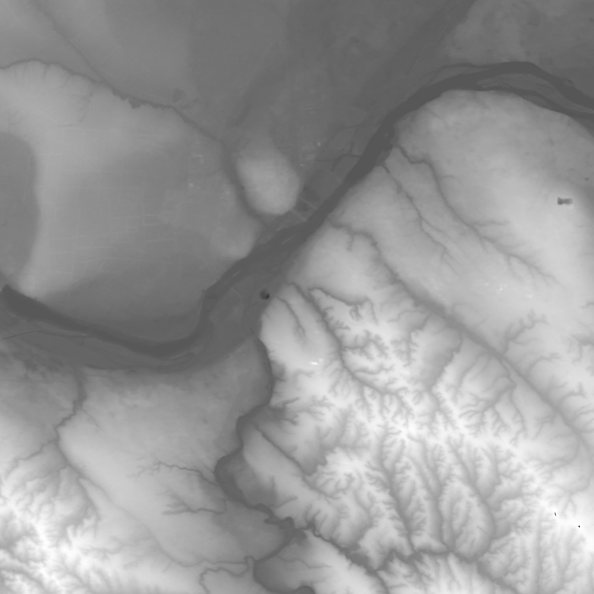
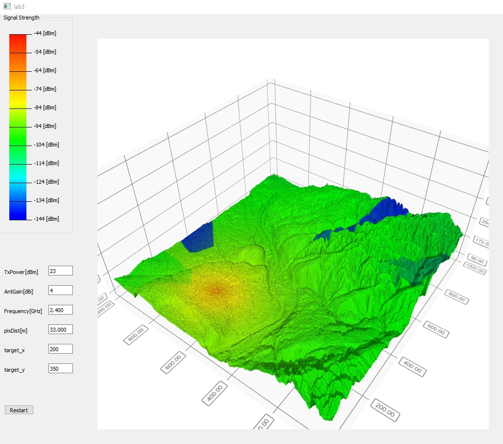
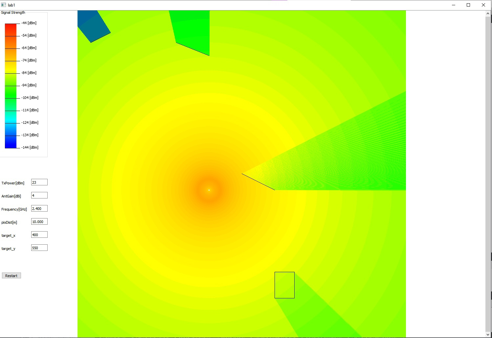

# Lab 4 добавление 3д карты

карта высот: 

пример работы: 

# Lab 3 рефакторинг 

# Визуализация сигнала

## Lab 2
### Визуализация сигнала с препядствиями

## Lab 1
#### Визуализация сигнала без препядствий 

Формула 
PL1 = 28.0 + 22log10(d) + 20log10(f)

d - расстояние
f - частота

